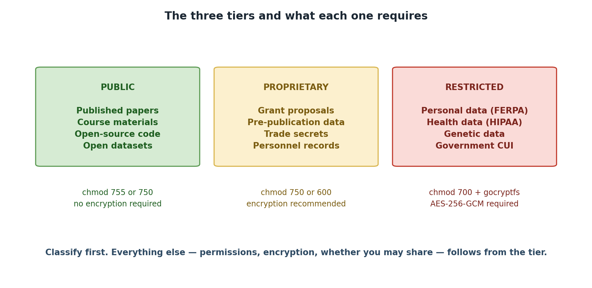

::::::::::::::::::::::::::::::::::::: objectives
- Understand the three classification tiers and their defining characteristics
- Learn the security requirements for each tier
- Recognize examples from different research disciplines
::::::::::::::::::::::::::::::::::::::::::::::::

::::::::::::::::::::::::::::::::::::: questions
- What distinguishes one classification tier from another?
- What security controls are required for each tier?
- What happens if I misclassify data?
::::::::::::::::::::::::::::::::::::::::::::::::

## Pomona's Three-Tier Classification System

Data classification at Pomona College follows a simple principle: **the more sensitive the data, the more security controls it requires**. The three tiers stack on top of each other; Restricted data includes all protections of Proprietary and Public.

{alt='The three data tiers side by side. PUBLIC includes published papers, course materials, open-source code and open datasets, using chmod 755 or 750 with no encryption required. PROPRIETARY includes grant proposals, pre-publication data, trade secrets and personnel records, using chmod 750 or 600 with encryption recommended. RESTRICTED includes personal data under FERPA, health data under HIPAA, genetic data and government CUI, using chmod 700 plus gocryptfs with AES-256-GCM encryption required.'}

## Tier 1: PUBLIC

**Definition:** Data that has been intentionally released for unrestricted use and is freely available to anyone, or data shared openly within Pomona College and authorized groups with no special risk of harm if accessed.

### Characteristics

- **Availability:** Either publicly available worldwide, or freely shared within Pomona/lab groups
- **Sensitivity:** No harm if accessed by authorized lab members or the public
- **Examples:** Published research papers, public datasets, course materials, lab notes, draft research shared with lab members, operational data, institutional announcements
- **Regulatory concern:** None (unless containing other sensitive data)

### Key Features

| Aspect | Details |
|--------|---------|
| **Encryption** | Not required |
| **Access controls** | None required for public; group-readable (750) for internal shared data |
| **Storage** | Anywhere on Sagehen HPC (`/rhome` or `/bigdata`) |
| **Sharing** | Unrestricted (public) or with lab members (shared within groups) |
| **Retention** | No special policy |
| **Audit logging** | Not required |
| **File permissions** | 755 (public) or 750 (group-shared) |

### Two Categories of Public Data

**Fully Public**: Released to the world
- Published manuscripts and supplementary data
- Open-source code repositories
- Datasets in public repositories (Zenodo, OSF, figshare)
- Institutional announcements and public reports

**Shared Internal to Groups**: Freely available within Pomona/lab
- Lab notebooks and research journals (shared with group)
- Preliminary analysis and working drafts (not yet published)
- Operational data (schedules, lab protocols, meeting notes)
- Course materials and lecture notes
- Raw data during analysis phase (before publication)

### Examples from Pomona Research

- **Published manuscript**: "Optimal metabolic pathway design using constraint-based modeling" published in *Nature Biotechnology* with data on GitHub
- **Open-source code**: Lab maintains public GitHub repository for molecular simulation software
- **Course materials**: Lecture notes, practice problems, and datasets for BIOL 101
- **Lab notebook**: Digital research journal shared among the lab (but not published)
- **Data in progress**: Raw measurements shared with lab members during analysis
- **Institutional data**: Published class schedule, faculty directory, graduation statistics
- **Data from public repositories**: Census data, genomics data from NCBI, weather data from NOAA

### Safeguards (Still Important!)

Even though Public data needs no special protection:
- **Verify before sharing**: Confirm data was actually approved for public release
- **Attribution**: Respect intellectual property and attribution requirements
- **Version control**: Clearly mark which version is public (some research evolves)
- **Metadata**: Include proper documentation so others can use it correctly
- **Confidentiality agreements**: Respect collaboration terms for internally shared data

## Summary Table

| Requirement | PUBLIC (green) | PROPRIETARY (orange) | RESTRICTED (red) |
|---|---|---|---|
| **Permissions** | 755 | 750 | 700 + gocryptfs |
| **Encryption** | Not required | Recommended | **REQUIRED** (AES-256-GCM) |
| **Audit logging** | Not required | Optional | **REQUIRED** |

{alt='A terminal creating three directories and three CSV files, one per classification tier, and applying paired chmod commands: 755 and 644 for public, 750 and 640 for proprietary, 700 and 600 for restricted. The ls -l listing shows the resulting permission strings, with the directories carrying an inherited setgid bit.'}

> **Permission variant on PROPRIETARY**: a `600` (user-only) variant may be appropriate
> for sub-team-only or single-PI files within a PROPRIETARY workflow. It is a *variant*
> of PROPRIETARY handling, not a separate tier — encryption is still optional and the
> data still belongs to the orange tier. Files needing user-only **and** strong
> protection belong in RESTRICTED (700 + gocryptfs).

::::::::::::::::::::::::::::::::::::: callout
## There Are Three Tiers, Not Four
Pomona's classification model has exactly three tiers: PUBLIC, PROPRIETARY, RESTRICTED. There is no fourth "INTERNAL" tier. If you encounter "INTERNAL" in legacy materials, treat it as PUBLIC (intra-group sharing) or PROPRIETARY (sensitive lab work). The April 2026 standardization removed the fourth tier to eliminate ambiguity.
::::::::::::::::::::::::::::::::::::::::::::::::

::::::::::::::::::::::::::::::::::::: challenge
### Challenge 3.1: Classify Pomona Research Datasets (Part 1)

For each dataset, identify the appropriate classification and explain your reasoning:
1. **BIOL 101 Course Data:**
   - Student names, email addresses, class schedule
   - Published aggregated grade distribution (average GPA by major)
2. **Economics Research:**
   - Aggregated economic indicators from public Census data
   - Survey responses from 500 households (de-identified but with geographic location)

::::::::::::::::::::::::::::::::::::: solution

## Solution

1. Student names + email + class schedule → **RESTRICTED** (FERPA-protected education record). Note: student names alone *may* be directory information unless the student has opted out, but the moment they're paired with academic records (class schedule, grades, course enrollment), the dataset becomes a FERPA-protected education record requiring RESTRICTED-tier handling (700 + gocryptfs). Aggregated grade distribution (no individual identification) → **PUBLIC**.
2. Census data → **PUBLIC** (already public, freely available); survey with location → **PUBLIC** (aggregated, de-identified) or **PROPRIETARY** if sensitive topics requiring restricted access

::::::::::::::::::::::::::::::::::::::::::::::::

::::::::::::::::::::::::::::::::::::::::::::::::

::::::::::::::::::::::::::::::::::::: keypoints
- Public data is either fully publicly available or freely shared within lab/groups; no special handling required
- File permissions: PUBLIC=755 (canonical)
- Public data still requires attribution and version control
- Two categories exist: fully public and shared internal to groups
- Classification determines where data is stored and how it's protected
::::::::::::::::::::::::::::::::::::::::::::::::
