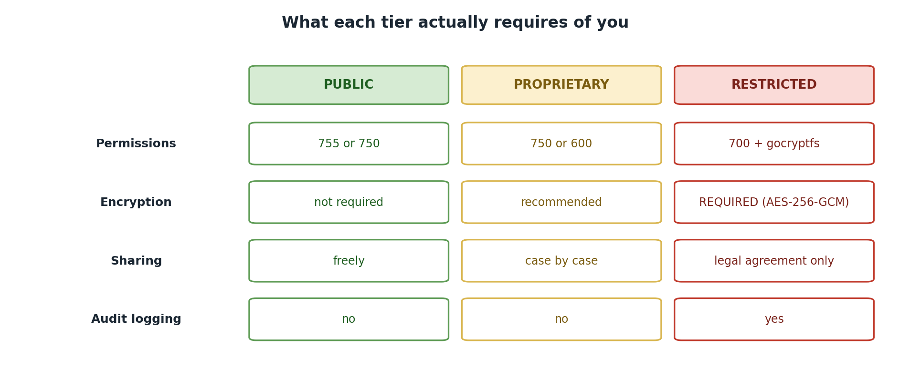

::::::::::::::::::::::::::::::::::::: objectives
- Apply Pomona's classification system to your own research data
- Use the decision tree to classify datasets systematically
- Recognize when to consult your PI or ORSP
::::::::::::::::::::::::::::::::::::::::::::::::

::::::::::::::::::::::::::::::::::::: questions
- How do I classify my specific research datasets?
- What information do I need to make good classification decisions?
- When should I ask for help?
::::::::::::::::::::::::::::::::::::::::::::::::

## The Classification Workflow

Classifying data is not a one-time event; it's an ongoing process as your research evolves. Here's the workflow:

```
1. Inventory your data
         ↓
2. Understand the content
         ↓
3. Apply classification rules
         ↓
4. Implement handling requirements
         ↓
5. Monitor and re-classify as needed
```

{alt='A table of handling requirements by tier. Permissions: 755 or 750 for PUBLIC, 750 or 600 for PROPRIETARY, 700 plus gocryptfs for RESTRICTED. Encryption: not required, recommended, and required with AES-256-GCM. Sharing: freely, case by case, and only under a legal agreement. Audit logging: no, no, and yes.'}

## Step 1: Inventory Your Data

Before you can classify, you need to know what you have.

### Creating a Data Inventory

For each research project or lab, list:

| Item | Example |
|------|---------|
| **Project name** | "Human gut microbiome and metabolic syndrome" |
| **Data type** | Raw sequencing reads, metadata, analysis results |
| **Data location** | `/bigdata/lab/<labname>/project_A` |
| **Size** | 5 TB raw data |
| **Source** | Sequencing facility, clinical partner institution |
| **People who need access** | PI (Dr. Smith), postdoc (Jane), graduate students (Tom, Maria) |
| **Retention requirement** | 7 years (NIH requirement) |
| **Special handling** | IRB-approved study with human subjects |

::::::::::::::::::::::::::::::::::::: callout

### Sample Inventory Template

```
Lab Data Classification Inventory
==================================

Project: [Project Title]
PI: [PI Name]
Date: [Date]

Dataset 1: [Name]
├─ Description: [What is this data?]
├─ Size: [GB/TB]
├─ Source: [Where did it come from?]
├─ Contains PII? [Yes/No]
├─ Contains export-controlled tech? [Yes/No]
├─ Student data? [Yes/No]
├─ Health data? [Yes/No]
├─ Current classification: [Public/Proprietary/Restricted]
└─ Reason: [Why this classification?]

Dataset 2: [Name]
├─ [Same fields...]
```
Use this template to document your data inventory for audit purposes.
::::::::::::::::::::::::::::::::::::::::::::::::

## Step 2: Understand the Content

Classification depends on understanding what your data *contains and implies*, not just its format.

### Key Questions to Ask

| Dimension | Question | Implication |
|-----------|----------|-------------|
| **Origin** | Published repository? | Likely Public |
| | Human subjects study? | Likely Restricted if identifiable |
| | DOD-funded? | Likely Restricted (CUI) |
| **Content** | Contains names/IDs linked to sensitive info? | Restricted |
| | Contains health data with identifiers? | Restricted (HIPAA) |
| | Contains export-controlled tech? | Restricted (EAR) |
| | Aggregated/anonymized? | Public or Proprietary |
| **Context** | Pre-publication competitive asset? | Proprietary |
| | Already published? | Public |
| | Privacy/legal harm if disclosed? | Restricted |

## Step 3: Apply Classification Rules

Use the decision tree systematically.

### The Systematic Approach

**Rule 1: Check for Regulatory Triggers (Automatic Restricted)**

```
Is ANY of the following true?
├─ Contains student education records? → RESTRICTED (FERPA)
├─ Contains health information linked to individuals? → RESTRICTED (HIPAA)
├─ Contains export-controlled research? → RESTRICTED (EAR/ITAR)
├─ Contains CUI or DOD-funded data? → RESTRICTED (NIST 800-171)
└─ If YES to any → **STOP. CLASSIFY AS RESTRICTED.**
   If NO → Continue to Rule 2.
```

**Rule 2: Check for Proprietary Triggers**

```
Is ANY of the following true?
├─ Contains PII or sensitive personal information? → PROPRIETARY (min)
├─ Unpublished novel findings (competitive asset)? → PROPRIETARY
├─ Grant proposal, patent, or IP disclosure? → PROPRIETARY
├─ Sensitive institutional data (salary, strategy)? → PROPRIETARY
└─ If YES to any → Classify as PROPRIETARY (or Restricted if also regulatory trigger)
   If NO → Continue to Rule 3.
```

**Rule 3: Check for Public Triggers**

```
Is ANY of the following true?
├─ Already published or intended for public use? → PUBLIC
├─ Freely shared within lab group? → PUBLIC
├─ Preliminary or in-progress data (shared with group)? → PUBLIC
├─ Data with no access restrictions? → PUBLIC
└─ If YES to any AND no regulatory/proprietary concerns → Classify as PUBLIC
```

::::::::::::::::::::::::::::::::::::: challenge
### Challenge 5.1: Classify Your Own Data

Using the systematic approach from this episode:
1. Choose a dataset from your own research
2. Apply the three rules (Regulatory → Proprietary → Public)
3. Document your reasoning
4. Identify anyone who needs access
5. Note any questions/escalations needed

:::::::::::::::::::::::::::::::::: solution

## Solution

Here is an example for a fictional genomics dataset:

```
DATASET: Sagehen Meadow Vole Whole-Genome Sequences

Regulatory Check:
- FERPA applies?  No (no student education records)
- HIPAA applies?  No (non-human species)
- Export-control applies?  No (basic ecological research)
- CUI applies?  No (NSF-funded, no DOD involvement)

Proprietary Check:
- Contains PII?  No (wildlife data, no human subjects)
- Novel unpublished findings?  Yes — first population genomics
  study of meadow voles in the Sagehen basin
- Competitive asset?  Yes — two other labs studying the same
  species; first-to-publish advantage

Classification Decision:
- Tier: PROPRIETARY
- Reasoning: No regulatory triggers, so not Restricted. However,
  the dataset contains novel unpublished findings with competitive
  value. Classify as Proprietary until the manuscript is accepted
  for publication, then reclassify to Public and deposit in NCBI SRA.
```

::::::::::::::::::::::::::::::::::

::::::::::::::::::::::::::::::::::::::::::::::::

::::::::::::::::::::::::::::::::::::: keypoints
- Inventory your data: know what you have before classifying
- Understand content: ask whether your data contains PII, health info, export-controlled tech
- Apply rules systematically: check Regulatory triggers first, then Proprietary, then Public
- Classification is not a one-time event; re-classify as research evolves
- Ask for help: consult PI, ORSP, or ITS when uncertain
::::::::::::::::::::::::::::::::::::::::::::::::

<!-- highlight <labname>/<myusername> placeholders in code blocks; remove if the varnish theme handles this natively -->
<script>(function(){var CSS='.sh-placeholder{color:#c2410c;font-weight:700}[data-bs-theme="dark"] .sh-placeholder,html.dark .sh-placeholder{color:#fdba74}@media (prefers-color-scheme: dark){[data-bs-theme="auto"] .sh-placeholder{color:#fdba74}}';var RX=/<labname>|<myusername>/g;function firstMatch(el){var w=document.createTreeWalker(el,NodeFilter.SHOW_TEXT,null),nodes=[],full='';while(w.nextNode()){nodes.push({n:w.currentNode,s:full.length});full+=w.currentNode.nodeValue;}RX.lastIndex=0;var m;while((m=RX.exec(full))){var s=m.index,e=s+m[0].length,inSpan=false,parts=[];for(var j=0;j<nodes.length;j++){var ns=nodes[j].s,ne=ns+nodes[j].n.nodeValue.length;if(ne<=s||ns>=e)continue;parts.push({node:nodes[j].n,a:Math.max(s-ns,0),b:Math.min(e-ns,nodes[j].n.nodeValue.length)});var p=nodes[j].n.parentNode;while(p&&p!==el){if(p.classList&&p.classList.contains('sh-placeholder')){inSpan=true;break;}p=p.parentNode;}}if(!inSpan&&parts.length)return parts;}return null;}function wrapParts(parts){for(var i=parts.length-1;i>=0;i--){var t=parts[i].node,txt=t.nodeValue,a=parts[i].a,b=parts[i].b;var span=document.createElement('span');span.className='sh-placeholder';span.textContent=txt.slice(a,b);var f=document.createDocumentFragment();if(a>0)f.appendChild(document.createTextNode(txt.slice(0,a)));f.appendChild(span);if(b<txt.length)f.appendChild(document.createTextNode(txt.slice(b)));t.parentNode.replaceChild(f,t);}}function run(){var st=document.createElement('style');st.textContent=CSS;document.head.appendChild(st);document.querySelectorAll('pre,code').forEach(function(el){var guard=0,parts;while((parts=firstMatch(el))&&guard++<500){wrapParts(parts);}});}if(document.readyState==='loading'){document.addEventListener('DOMContentLoaded',run);}else{run();}})();</script>
