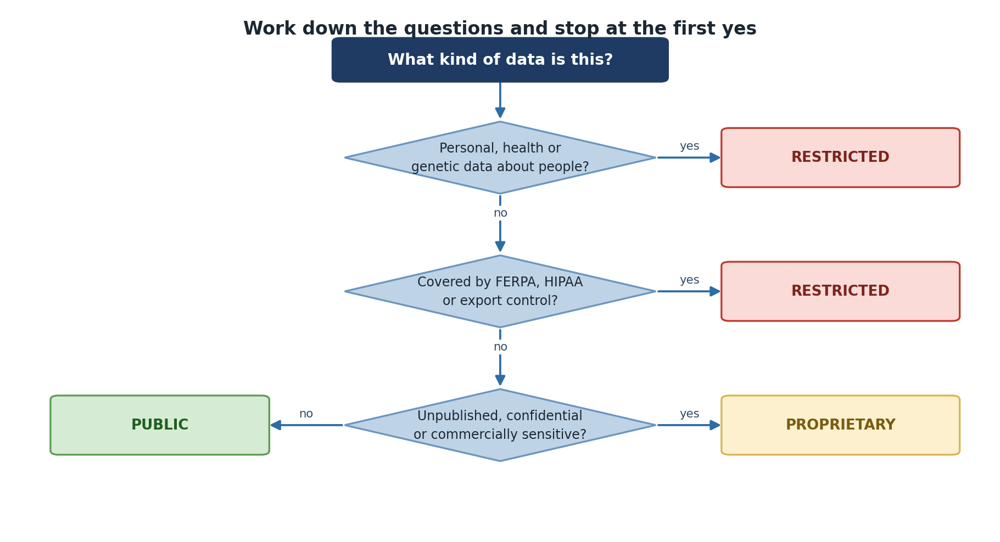

::::::::::::::::::::::::::::::::::::: objectives
- Use the classification decision tree to classify any dataset
- Document classification decisions for auditing
- Recognize common classification mistakes and how to avoid them
::::::::::::::::::::::::::::::::::::::::::::::::

::::::::::::::::::::::::::::::::::::: questions
- How do I document my classification for the audit trail?
- What are the most common classification mistakes?
- How do I handle reclassification as research evolves?
::::::::::::::::::::::::::::::::::::::::::::::::

## Classification Decision Tree

Use this flowchart to classify your data:

```
START: New dataset or file

│
├─> Does it contain student education records?
│   (grades, performance data, assessment results linked to students)
│   YES → RESTRICTED (FERPA)
│   NO → Continue
│
├─> Does it contain legally protected health information?
│   (names + medical conditions, health data, genetic data)
│   YES → RESTRICTED (HIPAA/Privacy)
│   NO → Continue
│
├─> Does it contain export-controlled research?
│   (cryptography, advanced materials, dual-use bio research)
│   YES → RESTRICTED (EAR/ITAR)
│   UNCERTAIN → Consult ORSP
│   NO → Continue
│
├─> Does it contain CUI or DOD-funded research data?
│   YES → RESTRICTED (NIST 800-171)
│   NO → Continue
│
├─> Does it contain any personally identifiable information?
│   (names, SSN, financial info, genetic data, sensitive personal info)
│   YES → PROPRIETARY (minimum; may be Restricted if sensitive)
│   NO → Continue
│
├─> Does it contain sensitive institutional data?
│   (unpublished research, grant proposals, business plans, salaries)
│   YES → PROPRIETARY
│   NO → Continue
│
├─> Is it restricted to specific authorized individuals?
│   (only certain people can access, not the entire group)
│   YES → PROPRIETARY
│   NO → PUBLIC (freely available or shared openly within lab/groups)
```

{alt='A decision tree. If the data is personal, health or genetic data about people, it is RESTRICTED. If it is covered by FERPA, HIPAA or export control, it is RESTRICTED. If it is unpublished, confidential or commercially sensitive, it is PROPRIETARY. Otherwise it is PUBLIC.'}

## Decision Documentation

Once you've classified, **document your decision**. This serves two purposes:
1. **Audit trail**: Shows you thought carefully about classification
2. **Consistency**: Helps team members re-classify correctly if you leave

::::::::::::::::::::::::::::::::::::: callout

### Classification Decision Form

```
DATA CLASSIFICATION DECISION RECORD
===================================

Project: [Name]
Date: [Date]
Classified by: [Name]

Dataset: [Dataset name/description]
Location: /bigdata/lab/<labname>/project_X

CLASSIFICATION DECISION: [PUBLIC / PROPRIETARY / RESTRICTED]

CLASSIFICATION REASONING: [Which rules triggered this classification]
REGULATORY FRAMEWORKS: [FERPA / HIPAA / EAR-ITAR / NIST 800-171 / Pomona ISP]
HANDLING: [Encryption / Access controls / Audit logging / De-id plan / Retention]
PEOPLE WHO NEED ACCESS: [Name/Role list]
RETENTION: [Until publication / 7 years / indefinite / etc.]
QUESTIONS: [Uncertainties requiring PI/ORSP review]
```

Store classification records in a shared lab document (e.g., `/bigdata/lab/<labname>/DATA_CLASSIFICATION_LOG.md`), accessible to your PI, updated when classification changes, and reviewed annually.
::::::::::::::::::::::::::::::::::::::::::::::::

## When to Ask for Help

- **Consult your PI** when uncertain about export control, collaboration agreements, human subjects, external sharing, or reclassification
- **Consult ORSP** for export control questions, IRB/FERPA applicability, CUI handling, or dual-use research concerns
- **Consult ITS** (its-hpc@pomona.edu) for classification decisions, encryption setup, access controls, or incident reporting

## Common Misclassifications

### Too High (Overly Restrictive)

**Scenario:** A researcher classifies all lab data as Restricted because she thinks "better safe than sorry."

**Problem:**
- Impedes legitimate collaboration
- Creates unnecessary encryption overhead
- Leads to audit fatigue (too much data flagged for review)

**Fix:** Use the decision tree; be precise about what's actually sensitive.

### Too Low (Inadequately Protective)

**Scenario:** A researcher classifies student survey data as Public because it's "only shared with the lab."

**Problem:**
- Violates FERPA (student data is Restricted)
- Creates legal/compliance liability
- Not discoverable during audit until breach occurs

**Fix:** Classify conservatively; when in doubt, ask your PI or contact its-hpc@pomona.edu

### Classifying by Format, Not Content

**Wrong:** "All .xlsx files are Public because they're spreadsheets"

**Right:** "This .xlsx contains student test scores, so it's Restricted. That .xlsx contains lab budget summaries, so it's Public."

→ **Content and context matter, not file type.**

### Never Changing Classification

**Wrong:** "I classified this as Proprietary six months ago, so it stays Proprietary forever"

**Right:** "I classified this as Proprietary when it was a draft paper. Now it's published, so it's Public."

→ **Re-classify regularly as your research evolves.**

::::::::::::::::::::::::::::::::::::: challenge
### Challenge 6.1: Reclassification Scenario

A researcher is wrapping up her PhD project. Her data evolution:
1. **Year 1 (Raw data):** Classification → ?
   - Lab is generating new datasets from a collaborator's samples
   - No publications yet
   - Shared among 5 lab members
2. **Year 2 (Analysis):** Classification → ?
   - Novel findings (unexpected mechanism)
   - Writing first manuscript
   - Preparing to submit to *Nature*
3. **Year 3 (Publication):** Classification → ?
   - Paper is published in open-access journal
   - Lab publishes data on public repository (GitHub)

For each stage, determine:
- What is the appropriate classification?
- What changed from previous stage?
- What handling requirements apply?

::::::::::::::::::::::::::::::::::::: solution

## Solution

1. **Public** (shared freely within group during raw data stage)
2. **Proprietary** (novel findings, competitive advantage during manuscript review)
3. **Public** (published and deposited in public repository)

Re-classification required at each transition!

::::::::::::::::::::::::::::::::::::::::::::::::

::::::::::::::::::::::::::::::::::::::::::::::::

::::::::::::::::::::::::::::::::::::: challenge
### Challenge 6.2: Real-World Classification

A computer science researcher is working on a deep learning model for medical image analysis. Her dataset includes:
- 10,000 chest X-ray images
- Patient age and gender (de-identified with code numbers)
- Radiologist diagnoses (labeled as positive/negative for pneumonia)

She wants to:
1. Share the dataset with a collaborator at another university
2. Upload the dataset to a cloud service for training models
3. Publish the dataset for reproducibility

For each action, determine:
- What classification does this data require?
- What are the barriers to this action?
- What would you recommend?

::::::::::::::::::::::::::::::::::::: solution

## Solution

**Classification:** **Restricted** (health information + potential re-identification from image metadata + diagnosis data)

**Barriers:**
- HIPAA-covered entity (if hospital data)
- Re-identification risk (even de-identified X-rays can identify individuals)
- Legal/ethical constraints on external sharing

**Recommendations:**
1. Collaborator sharing: Collaboration agreement required; encrypted transfer; access to encrypted instance only
2. Cloud training: Use DEA or BAA; encrypt data in transit/at rest; consider federated learning instead
3. Publishing: Publish only heavily de-identified version (aggregated results); keep raw data restricted

::::::::::::::::::::::::::::::::::::::::::::::::

::::::::::::::::::::::::::::::::::::::::::::::::

::::::::::::::::::::::::::::::::::::: keypoints
- Use the decision tree to classify systematically: check regulatory triggers first
- Document decisions: create an audit trail for classification choices
- Re-classify regularly: as research evolves (publication, sharing, retention end)
- Avoid common mistakes: classifying by format, over-classifying, or never reclassifying
- Implement requirements: classification is meaningless without proper handling
::::::::::::::::::::::::::::::::::::::::::::::::

<!-- highlight <labname>/<myusername> placeholders in code blocks; remove if the varnish theme handles this natively -->
<script>(function(){var CSS='.sh-placeholder{color:#c2410c;font-weight:700}[data-bs-theme="dark"] .sh-placeholder,html.dark .sh-placeholder{color:#fdba74}@media (prefers-color-scheme: dark){[data-bs-theme="auto"] .sh-placeholder{color:#fdba74}}';var RX=/<labname>|<myusername>/g;function firstMatch(el){var w=document.createTreeWalker(el,NodeFilter.SHOW_TEXT,null),nodes=[],full='';while(w.nextNode()){nodes.push({n:w.currentNode,s:full.length});full+=w.currentNode.nodeValue;}RX.lastIndex=0;var m;while((m=RX.exec(full))){var s=m.index,e=s+m[0].length,inSpan=false,parts=[];for(var j=0;j<nodes.length;j++){var ns=nodes[j].s,ne=ns+nodes[j].n.nodeValue.length;if(ne<=s||ns>=e)continue;parts.push({node:nodes[j].n,a:Math.max(s-ns,0),b:Math.min(e-ns,nodes[j].n.nodeValue.length)});var p=nodes[j].n.parentNode;while(p&&p!==el){if(p.classList&&p.classList.contains('sh-placeholder')){inSpan=true;break;}p=p.parentNode;}}if(!inSpan&&parts.length)return parts;}return null;}function wrapParts(parts){for(var i=parts.length-1;i>=0;i--){var t=parts[i].node,txt=t.nodeValue,a=parts[i].a,b=parts[i].b;var span=document.createElement('span');span.className='sh-placeholder';span.textContent=txt.slice(a,b);var f=document.createDocumentFragment();if(a>0)f.appendChild(document.createTextNode(txt.slice(0,a)));f.appendChild(span);if(b<txt.length)f.appendChild(document.createTextNode(txt.slice(b)));t.parentNode.replaceChild(f,t);}}function run(){var st=document.createElement('style');st.textContent=CSS;document.head.appendChild(st);document.querySelectorAll('pre,code').forEach(function(el){var guard=0,parts;while((parts=firstMatch(el))&&guard++<500){wrapParts(parts);}});}if(document.readyState==='loading'){document.addEventListener('DOMContentLoaded',run);}else{run();}})();</script>
