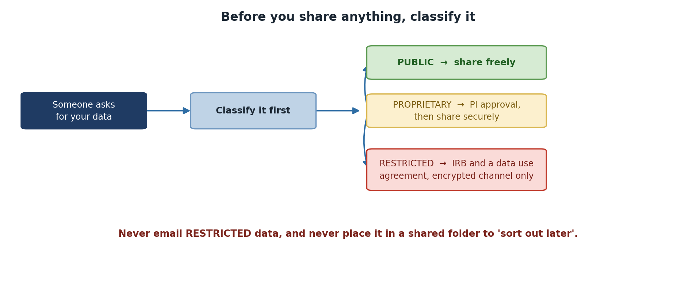

::::::::::::::::::::::::::::::::::::: objectives
- Share data with collaborators while maintaining security
- Use institutional cloud storage (Box, OneDrive) with encryption
- Recognize international data transfer restrictions
- Write appropriate data availability statements
::::::::::::::::::::::::::::::::::::::::::::::::

::::::::::::::::::::::::::::::::::::: questions
- How do I share classified data with external collaborators?
- Can I use Google Drive or Dropbox for research data?
- Are there restrictions on sharing with international collaborators?
- How do I publish my data while protecting privacy?
::::::::::::::::::::::::::::::::::::::::::::::::

## The Sharing Problem

Research is collaborative. You need to share data with PhD students at other universities, industry partners, international collaborators, funding agencies, journal reviewers, and other research groups. But you also need to protect classified data. This episode shows how to do both safely.

::::::::::::::::::::::::::::::::::::: callout

{alt='A flow beginning when someone asks for your data. Classify it first, then follow the tier: PUBLIC can be shared freely; PROPRIETARY needs PI approval and then a secure transfer; RESTRICTED needs IRB approval and a data use agreement, and may only travel over an encrypted channel. A warning says never to email RESTRICTED data or leave it in a shared folder to sort out later.'}

## Quick Reference: What Can Be Shared?

| Classification | Can Share? | Restrictions |
|---|---|---|
| **Public** | Yes, freely | None |
| **Proprietary** | With permission | Requires collaboration agreement |
| **Restricted** | NO | Not without de-identification and approval |

**Core principle:** Restricted data (FERPA, CUI, PII, export-controlled) cannot be shared in its original form.

::::::::::::::::::::::::::::::::::::::::::::::::

## Sharing Public Data

**Can be shared:** Freely, with anyone, any method

```bash
# Post on GitHub, Zenodo, OSF, or institutional repository
# Email directly
# Upload to shared cloud storage
# Include in paper supplementary materials
```

**Sharing methods for data shared within groups:**
1. Sagehen HPC direct access (collaborators get accounts)
2. Pomona-managed Box or OneDrive
3. Secure SFTP transfer via ITS
4. GitHub or public repository (if fully public)

## Sharing Proprietary Data

### Sharing with External Collaborators

**Requires:**
1. Collaboration agreement (contract)
2. Secure transfer (encrypted)
3. Access controls at recipient's site
4. Time-limited access

### Transferring Proprietary Data Securely

**Option A: Encrypted ZIP file (fast, simple)**

```bash
zip -e proprietary_data.zip proposal_2025.pdf budget_narrative.doc
# Send ZIP via email, password via separate channel (phone call)
```

**Option B: Pomona Box (institutional, recommended)**

```bash
# Upload to Box with password + expiration
# Box provides HTTPS/TLS encryption, access controls, audit logging
rclone copy /rhome/<myusername>/data/ pomona_box:research/project_A/
```

**Option C: SFTP via ITS Secure Transfer**

```bash
# Request SFTP server access from ITS (its-hpc@pomona.edu)
sftp external_collaborator@secure.pomona.edu
put proprietary_data.tar.gz /drop_zone/
```

## Sharing Restricted Data

### Core Rule: Cannot Share Directly

**Restricted data cannot be shared with external parties in its original, identifiable form.** If you need to share research findings based on restricted data, you must de-identify first (see Episode 12).

## Using Institutional Cloud Storage

### Pomona Box (Recommended)

Box is Pomona's institutional cloud storage with built-in encryption and access controls.

**Box Security:**
- HTTPS/TLS encryption in transit
- AES encryption at rest
- Granular access controls (file-level)
- Audit logging available
- Compliant with FERPA, HIPAA standards

**NOT for Restricted data** (unless de-identified first).

### What NOT to Use

**Do NOT use for research data:**
- Google Drive, Dropbox, iCloud
- AWS S3 (unless with specific institutional agreement)
- Personal cloud accounts

**Why:**
- No FERPA/HIPAA compliance
- Data may be used for training AI models
- No enterprise encryption standards
- No audit logging

## International Collaboration and Export Control

If your research touches **cryptography, advanced materials, biotech, or semiconductors**, you may be subject to **EAR/ITAR export controls**.

```
U.S. persons (U.S. citizens, permanent residents)
    → Can access any data

Non-U.S. persons on approved projects
    → Can access with special license/agreement

Non-approved non-U.S. persons
    → CANNOT access export-controlled research
```

**Before sharing with international collaborators:**

1. Does my research involve novel cryptographic algorithms, advanced materials, semiconductor design, biological agents, or military applications?
2. **If YES:** Contact ORSP (orsp@pomona.edu) for approval
3. **If UNCERTAIN:** Consult ORSP anyway -- better safe than violating federal law

## Publishing Data in Repositories

**Repositories suitable for Pomona research:**

| Repository | Suitable For | Access |
|---|---|---|
| **Zenodo** | General research data | Open |
| **OSF** | Multi-discipline projects | Open or restricted |
| **NCBI** | Biological/medical data | Open (de-identified) |
| **GitHub** | Code and some data | Public or private |
| **Figshare** | Figures, datasets | Open |
| **Dryad** | Data underlying publications | Open (curated) |

### Data Availability Statements

Required by most journals. Examples:

**Public data:**
```
"All data are publicly available at Zenodo
(https://doi.org/10.5281/zenodo.XXXXXXX)"
```

**Restricted data:**
```
"Data contain sensitive information (student records protected
under FERPA). De-identified data are available upon request.
Original data are available to qualified researchers under
data use agreement subject to IRB approval."
```

::::::::::::::::::::::::::::::::::::: challenge
### Challenge 11.1: Sharing Decision Tree

For each dataset, decide the appropriate sharing method:
1. Published research paper data
2. Draft grant proposal
3. Student survey responses
4. Preliminary analysis (shared with lab)
5. Export-controlled simulation code

::::::::::::::::::::::::::::::::::::: solution

## Solution

1. Published research paper data → **Public Zenodo deposit**
2. Draft grant proposal → **Encrypted transfer** with collaboration agreement; **Pomona Box** with time-limited access
3. Student survey responses → **De-identify + publish**; keep encrypted original separate
4. Preliminary analysis → **Sagehen direct access** or **Pomona Box** with group access
5. Export-controlled code → **ORSP approval required**; can only share with approved U.S. persons or non-U.S. persons with deemed export license

::::::::::::::::::::::::::::::::::::::::::::::::

::::::::::::::::::::::::::::::::::::::::::::::::

::::::::::::::::::::::::::::::::::::: keypoints
- Public data can be shared freely with anyone
- Proprietary data requires collaboration agreement + secure transfer
- Restricted data cannot be shared directly; must be de-identified first
- Use institutional Box/OneDrive; avoid personal cloud storage (Google Drive, Dropbox)
- Export-controlled research requires ORSP approval before international sharing
- Publish data with DOI for reproducibility and impact
::::::::::::::::::::::::::::::::::::::::::::::::

<!-- highlight <labname>/<myusername> placeholders in code blocks; remove if the varnish theme handles this natively -->
<script>(function(){var CSS='.sh-placeholder{color:#c2410c;font-weight:700}[data-bs-theme="dark"] .sh-placeholder,html.dark .sh-placeholder{color:#fdba74}@media (prefers-color-scheme: dark){[data-bs-theme="auto"] .sh-placeholder{color:#fdba74}}';var RX=/<labname>|<myusername>/g;function firstMatch(el){var w=document.createTreeWalker(el,NodeFilter.SHOW_TEXT,null),nodes=[],full='';while(w.nextNode()){nodes.push({n:w.currentNode,s:full.length});full+=w.currentNode.nodeValue;}RX.lastIndex=0;var m;while((m=RX.exec(full))){var s=m.index,e=s+m[0].length,inSpan=false,parts=[];for(var j=0;j<nodes.length;j++){var ns=nodes[j].s,ne=ns+nodes[j].n.nodeValue.length;if(ne<=s||ns>=e)continue;parts.push({node:nodes[j].n,a:Math.max(s-ns,0),b:Math.min(e-ns,nodes[j].n.nodeValue.length)});var p=nodes[j].n.parentNode;while(p&&p!==el){if(p.classList&&p.classList.contains('sh-placeholder')){inSpan=true;break;}p=p.parentNode;}}if(!inSpan&&parts.length)return parts;}return null;}function wrapParts(parts){for(var i=parts.length-1;i>=0;i--){var t=parts[i].node,txt=t.nodeValue,a=parts[i].a,b=parts[i].b;var span=document.createElement('span');span.className='sh-placeholder';span.textContent=txt.slice(a,b);var f=document.createDocumentFragment();if(a>0)f.appendChild(document.createTextNode(txt.slice(0,a)));f.appendChild(span);if(b<txt.length)f.appendChild(document.createTextNode(txt.slice(b)));t.parentNode.replaceChild(f,t);}}function run(){var st=document.createElement('style');st.textContent=CSS;document.head.appendChild(st);document.querySelectorAll('pre,code').forEach(function(el){var guard=0,parts;while((parts=firstMatch(el))&&guard++<500){wrapParts(parts);}});}if(document.readyState==='loading'){document.addEventListener('DOMContentLoaded',run);}else{run();}})();</script>
